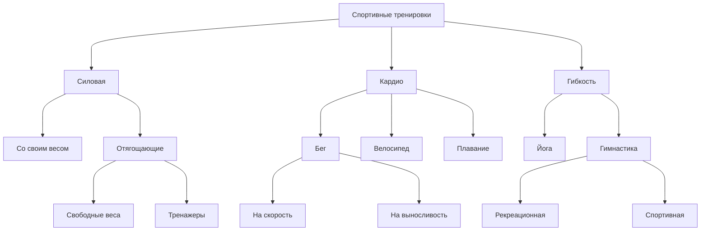

## Дерево

## Атрибуты

1. Время тренировки (числовой)
2. Количество подходов (числовой)
3. Требуется спортивный инвентарь (булевый)
4. Направленность (категориальный) - поддержание физической формы, похудение, набор физической массы, укрепление мышц
5. Требуемый уровень подготовки (категориальный) - низкий, средний, высокий
6. Группа мышц (категориальный) -- нижняя, верхняя, все
7. Тяжесть длительного выполнения тренировки (нечеткий)
